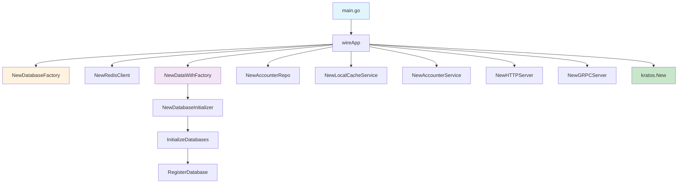
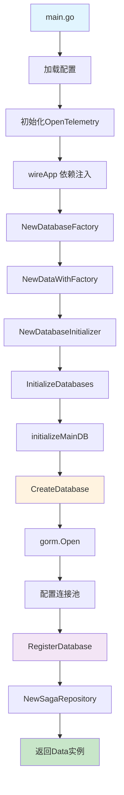
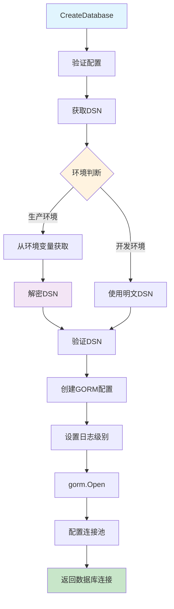
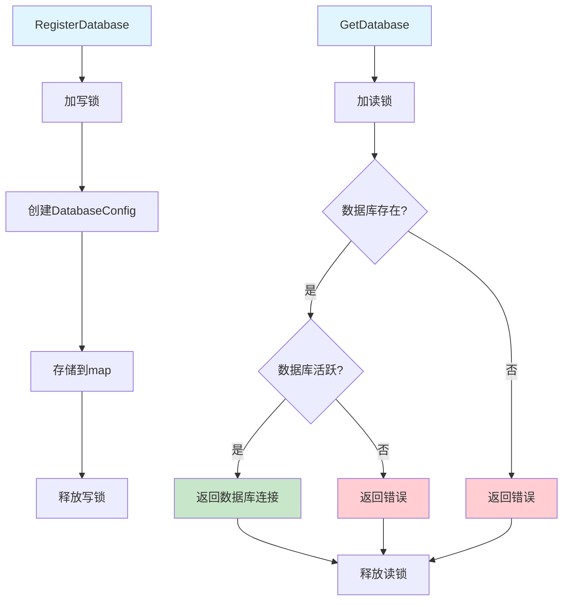
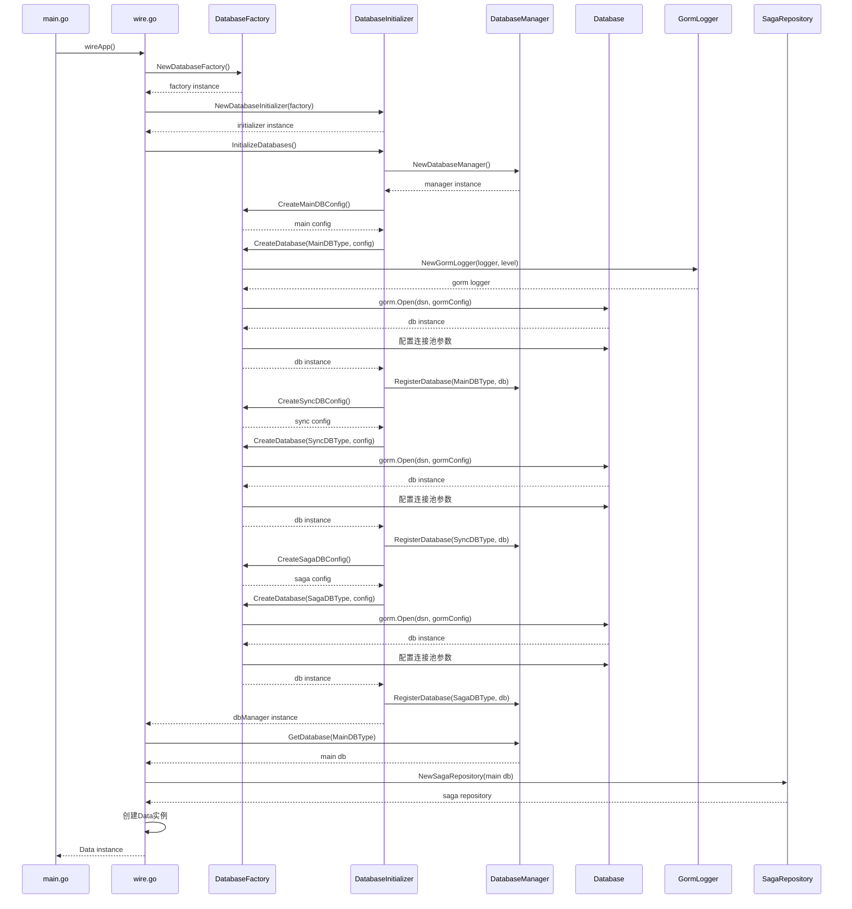
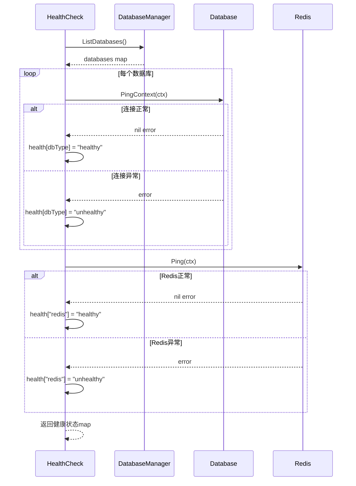

# 数据工厂创建与数据库连接流程详解

## 📋 目录

- [概述](#概述)
- [架构设计](#架构设计)
- [启动流程](#启动流程)
- [依赖注入](#依赖注入)
- [数据库工厂](#数据库工厂)
- [数据库初始化](#数据库初始化)
- [Saga 集成](#saga-集成)
- [配置说明](#配置说明)
- [关键代码](#关键代码)
- [流程图](#流程图)
- [最佳实践](#最佳实践)

## 🎯 概述

本文档详细描述了 Nancalacc 项目中数据工厂的创建和数据库连接流程。项目采用工厂模式、依赖注入和分层架构，实现了灵活、可扩展的数据库连接管理。

### 核心特性

- ✅ **工厂模式**：统一管理数据库连接创建
- ✅ **依赖注入**：使用 Wire 框架管理依赖关系
- ✅ **多数据库支持**：支持主数据库、同步数据库、Saga 数据库等
- ✅ **连接池管理**：优化数据库连接性能
- ✅ **OpenTelemetry 集成**：完整的可观测性支持
- ✅ **Saga 分布式事务**：集成 Saga 模式支持

## 🏗️ 架构设计

### 分层架构

```
┌─────────────────────────────────────────────────────────────┐
│                        Application Layer                     │
│  ┌─────────────┐  ┌─────────────┐  ┌─────────────┐          │
│  │   main.go   │  │   wire.go   │  │ wire_gen.go │          │
│  └─────────────┘  └─────────────┘  └─────────────┘          │
└─────────────────────────────────────────────────────────────┘
                              │
┌─────────────────────────────────────────────────────────────┐
│                        Data Layer                           │
│  ┌─────────────┐  ┌─────────────┐  ┌─────────────┐          │
│  │ data.go     │  │ factory.go  │  │ init.go     │          │
│  └─────────────┘  └─────────────┘  └─────────────┘          │
└─────────────────────────────────────────────────────────────┘
                              │
┌─────────────────────────────────────────────────────────────┐
│                    Database Layer                           │
│  ┌─────────────┐  ┌─────────────┐  ┌─────────────┐          │
│  │   Main DB   │  │   Sync DB   │  │   Saga DB   │          │
│  └─────────────┘  └─────────────┘  └─────────────┘          │
└─────────────────────────────────────────────────────────────┘
```

### 核心组件

1. **DatabaseFactory**：数据库连接工厂
2. **DatabaseManager**：数据库管理器
3. **DatabaseInitializer**：数据库初始化器
4. **SagaRepository**：Saga 分布式事务仓库

## 🚀 启动流程

### 1. 应用入口

**文件：`cmd/nancalacc/main.go`**

```go
func main() {
    // 1. 加载配置
    flag.Parse()
    logger := log.With(log.NewStdLogger(os.Stdout),
        "ts", log.DefaultTimestamp,
        "caller", log.DefaultCaller,
        "service.id", Name,
        "service.name", Name,
        "service.version", Version,
        "trace.id", tracing.TraceID(),
        "span.id", tracing.SpanID(),
    )

    // 2. 初始化OpenTelemetry
    if err := otel.InitOpenTelemetry(); err != nil {
        panic(err)
    }

    // 3. 依赖注入创建应用
    app, cleanup, err := wireApp(confServer, confData, logger, otelConfig)
    if err != nil {
        panic(err)
    }
    defer cleanup()

    // 4. 启动应用
    if err := app.Run(); err != nil {
        panic(err)
    }
}
```

### 2. 依赖注入配置

**文件：`cmd/nancalacc/wire.go`**

```go
//go:build wireinject
// +build wireinject

// The build tag makes sure the stub is not built in the final build.

package main

import (
    "github.com/go-kratos/kratos/v2"
    "github.com/go-kratos/kratos/v2/log"
    "github.com/google/wire"
    "nancalacc/internal/biz"
    "nancalacc/internal/conf"
    "nancalacc/internal/data"
    "nancalacc/internal/server"
    "nancalacc/internal/service"
)

// wireApp init kratos application.
func wireApp(*conf.Server, *conf.Data, log.Logger, *conf.OpenTelemetry) (*kratos.App, func(), error) {
    panic(wire.Build(server.ProviderSet, data.ProviderSet, biz.ProviderSet, service.ProviderSet, newApp))
}
```

### 3. 数据层依赖注入

**文件：`internal/data/data.go`**

```go
// ProviderSet is data providers.
var ProviderSet = wire.NewSet(
    NewRedisClient,
    NewAccounterRepo,
    NewLocalCacheService,
    NewDatabaseFactory,     // 数据库工厂
    NewDatabaseInitializer, // 数据库初始化器
    NewDataWithFactory,     // 使用工厂创建数据层
)
```

## 🔧 依赖注入

### 执行顺序

**文件：`cmd/nancalacc/wire_gen.go`**

```go
// wireApp 依赖注入执行函数
func wireApp(confServer *conf.Server, confData *conf.Data, logger log.Logger, otelConfig *conf.OpenTelemetry) (*kratos.App, func(), error) {
    // 1. 创建数据库工厂
    databaseFactory := NewDatabaseFactory(confData, logger, otelConfig)
    
    // 2. 创建 Redis 客户端
    redisClient := NewRedisClient(confData, logger)
    
    // 3. 使用工厂创建数据层
    data, cleanup, err := NewDataWithFactory(databaseFactory, redisClient, logger)
    if err != nil {
        return nil, nil, err
    }
    
    // 4. 创建仓库
    accounterRepo := NewAccounterRepo(data, logger)
    
    // 5. 创建缓存服务
    localCacheService := NewLocalCacheService(confData, logger)
    
    // 6. 创建服务层
    accounterService := service.NewAccounterService(accounterRepo, localCacheService, logger)
    
    // 7. 创建 HTTP 服务器
    httpServer := server.NewHTTPServer(confServer, accounterService, logger)
    
    // 8. 创建 gRPC 服务器
    grpcServer := server.NewGRPCServer(confServer, accounterService, logger)
    
    // 9. 创建应用实例
    app := kratos.New(
        kratos.ID(confServer.Http.Addr),
        kratos.Name(Name),
        kratos.Version(Version),
        kratos.Metadata(map[string]string{}),
        kratos.Logger(logger),
        kratos.Server(
            httpServer,
            grpcServer,
        ),
    )
    
    return app, cleanup, nil
}
```

### 依赖关系图




## 🏭 数据库工厂

### 工厂创建

**文件：`internal/data/database_factory.go`**

```go
// DatabaseFactory 数据库连接工厂
type DatabaseFactory struct {
    config     *conf.Data
    logger     log.Logger
    otelConfig *conf.OpenTelemetry // OpenTelemetry配置
}

// NewDatabaseFactory 创建数据库工厂
func NewDatabaseFactory(config *conf.Data, logger log.Logger, otelConfig *conf.OpenTelemetry) *DatabaseFactory {
    return &DatabaseFactory{
        config:     config,
        logger:     logger,
        otelConfig: otelConfig,
    }
}

// CreateDatabase 创建数据库连接
func (df *DatabaseFactory) CreateDatabase(dbType DatabaseType, config *DatabaseConnectionConfig) (*gorm.DB, error) {
    if config == nil {
        return nil, errors.New("database config is nil")
    }

    // 获取数据库连接字符串
    dsn, err := df.getDSN(config)
    if err != nil {
        return nil, fmt.Errorf("failed to get DSN for %s: %w", dbType, err)
    }

    // 确定GORM日志级别：OpenTelemetry配置优先，数据库配置作为默认值
    var logLevel string
    if df.otelConfig != nil && df.otelConfig.Logs != nil && df.otelConfig.Logs.Gorm != nil && df.otelConfig.Logs.Gorm.LogLevel != "" {
        logLevel = df.otelConfig.Logs.Gorm.LogLevel
    } else if config.LogLevel != "" {
        logLevel = config.LogLevel
    } else {
        logLevel = "info" // 默认日志级别
    }

    // 创建使用OpenTelemetry logger的GORM配置
    gormConfig := &gorm.Config{
        Logger: NewGormLogger(df.logger, logLevel),
    }

    // 打开数据库连接
    db, err := gorm.Open(mysql.Open(dsn), gormConfig)
    if err != nil {
        df.logger.Log(log.LevelError, "msg", "failed to open database", "type", dbType, "error", err)
        return nil, fmt.Errorf("failed to open database %s: %w", dbType, err)
    }

    // 配置连接池
    sqlDB, err := db.DB()
    if err != nil {
        return nil, fmt.Errorf("failed to get underlying sql.DB for %s: %w", dbType, err)
    }

    // 设置连接池参数
    if config.MaxOpenConns > 0 {
        sqlDB.SetMaxOpenConns(config.MaxOpenConns)
    }
    if config.MaxIdleConns > 0 {
        sqlDB.SetMaxIdleConns(config.MaxIdleConns)
    }
    if config.ConnMaxLifetime > 0 {
        sqlDB.SetConnMaxLifetime(config.ConnMaxLifetime)
    }

    df.logger.Log(log.LevelInfo, "msg", "database connection created",
        "type", dbType, "max_open_conns", config.MaxOpenConns,
        "max_idle_conns", config.MaxIdleConns)

    return db, nil
}
```

### 配置创建方法

```go
// CreateMainDBConfig 创建主数据库配置
func (df *DatabaseFactory) CreateMainDBConfig() *DatabaseConnectionConfig {
    config := NewDatabaseConnectionConfig()

    if df.config.Database != nil {
        config.Source = df.config.Database.Source
        config.SourceKey = df.config.Database.SourceKey
        config.Env = df.config.Database.Env
        config.MaxOpenConns = int(df.config.Database.MaxOpenConns)
        config.MaxIdleConns = int(df.config.Database.MaxIdleConns)
        config.Enable = df.config.Database.Enable

        if df.config.Database.ConnMaxLifetime != "" {
            if duration, err := time.ParseDuration(df.config.Database.ConnMaxLifetime); err == nil {
                config.ConnMaxLifetime = duration
            }
        }
    }

    return config
}

// CreateSyncDBConfig 创建同步数据库配置
func (df *DatabaseFactory) CreateSyncDBConfig() *DatabaseConnectionConfig {
    config := NewDatabaseConnectionConfig()

    if df.config.DatabaseSync != nil {
        config.Source = df.config.DatabaseSync.Source
        config.SourceKey = df.config.DatabaseSync.SourceKey
        config.Env = df.config.DatabaseSync.Env
        config.MaxOpenConns = int(df.config.DatabaseSync.MaxOpenConns)
        config.MaxIdleConns = int(df.config.DatabaseSync.MaxIdleConns)

        if df.config.DatabaseSync.ConnMaxLifetime != "" {
            if duration, err := time.ParseDuration(df.config.DatabaseSync.ConnMaxLifetime); err == nil {
                config.ConnMaxLifetime = duration
            }
        }
    }

    return config
}
```

## 🔄 数据库初始化

### 初始化器创建

**文件：`internal/data/database_init.go`**

```go
// DatabaseInitializer 数据库初始化器
type DatabaseInitializer struct {
    factory *DatabaseFactory
    logger  log.Logger
}

// NewDatabaseInitializer 创建数据库初始化器
func NewDatabaseInitializer(factory *DatabaseFactory, logger log.Logger) *DatabaseInitializer {
    return &DatabaseInitializer{
        factory: factory,
        logger:  logger,
    }
}
```

### 初始化所有数据库

```go
// InitializeDatabases 初始化所有数据库连接
func (di *DatabaseInitializer) InitializeDatabases() (*DatabaseManager, error) {
    dbManager := NewDatabaseManager()

    // 初始化主数据库
    if err := di.initializeMainDB(dbManager); err != nil {
        di.logger.Log(log.LevelError, "msg", "failed to initialize main database", "error", err)
        return nil, fmt.Errorf("failed to initialize main database: %w", err)
    }

    // 初始化同步数据库
    if err := di.initializeSyncDB(dbManager); err != nil {
        di.logger.Log(log.LevelError, "msg", "failed to initialize sync database", "error", err)
        return nil, fmt.Errorf("failed to initialize sync database: %w", err)
    }

    // 初始化 Saga 数据库
    if err := di.initializeSagaDB(dbManager); err != nil {
        di.logger.Log(log.LevelWarn, "msg", "failed to initialize saga database", "error", err)
        // Saga 数据库初始化失败不影响主流程
    }

    // 初始化用户数据库（可选）
    if err := di.initializeUserDB(dbManager); err != nil {
        di.logger.Log(log.LevelWarn, "msg", "failed to initialize user database", "error", err)
        // 用户数据库初始化失败不影响主流程
    }

    // 初始化日志数据库（可选）
    if err := di.initializeLogDB(dbManager); err != nil {
        di.logger.Log(log.LevelWarn, "msg", "failed to initialize log database", "error", err)
        // 日志数据库初始化失败不影响主流程
    }

    di.logger.Log(log.LevelInfo, "msg", "all databases initialized successfully")
    return dbManager, nil
}
```

### 单个数据库初始化

```go
// initializeMainDB 初始化主数据库
func (di *DatabaseInitializer) initializeMainDB(dbManager *DatabaseManager) error {
    config := di.factory.CreateMainDBConfig()

    if !config.Enable {
        di.logger.Log(log.LevelInfo, "msg", "main database is disabled")
        return nil
    }

    db, err := di.factory.CreateDatabase(MainDBType, config)
    if err != nil {
        return fmt.Errorf("failed to create main database: %w", err)
    }

    dbManager.RegisterDatabase(MainDBType, "main", db, config)
    di.logger.Log(log.LevelInfo, "msg", "main database initialized successfully")
    return nil
}

// initializeSyncDB 初始化同步数据库
func (di *DatabaseInitializer) initializeSyncDB(dbManager *DatabaseManager) error {
    config := di.factory.CreateSyncDBConfig()

    if !config.Enable {
        di.logger.Log(log.LevelInfo, "msg", "sync database is disabled")
        return nil
    }

    db, err := di.factory.CreateDatabase(SyncDBType, config)
    if err != nil {
        return fmt.Errorf("failed to create sync database: %w", err)
    }

    dbManager.RegisterDatabase(SyncDBType, "sync", db, config)
    di.logger.Log(log.LevelInfo, "msg", "sync database initialized successfully")
    return nil
}

// initializeSagaDB 初始化 Saga 数据库
func (di *DatabaseInitializer) initializeSagaDB(dbManager *DatabaseManager) error {
    config := di.factory.CreateSagaDBConfig()

    if !config.Enable {
        di.logger.Log(log.LevelInfo, "msg", "saga database is disabled")
        return nil
    }

    db, err := di.factory.CreateDatabase(SagaDBType, config)
    if err != nil {
        return fmt.Errorf("failed to create saga database: %w", err)
    }

    dbManager.RegisterDatabase(SagaDBType, "saga", db, config)
    di.logger.Log(log.LevelInfo, "msg", "saga database initialized successfully")
    return nil
}
```

## 🔗 Saga 集成

### Saga 数据库配置

**文件：`internal/data/database_factory.go`**

```go
// CreateSagaDBConfig 创建 Saga 数据库配置
func (df *DatabaseFactory) CreateSagaDBConfig() *DatabaseConnectionConfig {
    config := NewDatabaseConnectionConfig()
    
    // 从配置中获取 Saga 数据库配置
    // 注意：这里需要根据实际的配置结构进行调整
    // 如果配置中没有专门的 Saga 数据库配置，可以使用主数据库配置
    if df.config.Database != nil {
        config.Source = df.config.Database.Source
        config.SourceKey = df.config.Database.SourceKey
        config.Env = df.config.Database.Env
        config.MaxOpenConns = int(df.config.Database.MaxOpenConns)
        config.MaxIdleConns = int(df.config.Database.MaxIdleConns)
        config.Enable = df.config.Database.Enable

        if df.config.Database.ConnMaxLifetime != "" {
            if duration, err := time.ParseDuration(df.config.Database.ConnMaxLifetime); err == nil {
                config.ConnMaxLifetime = duration
            }
        }
    }

    return config
}
```

### Saga 仓库创建

**文件：`internal/data/saga_repository.go`**

Saga 仓库提供了完整的分布式事务数据访问功能：

#### 核心功能

1. **Saga 实例管理**
   - `CreateInstance`: 创建新的 Saga 实例
   - `GetInstance`: 根据实例ID获取 Saga 实例
   - `UpdateInstanceStatus`: 更新实例状态
   - `UpdateInstance`: 更新完整实例信息
   - `ListInstancesByStatus`: 根据状态查询实例列表

2. **Saga 步骤管理**
   - `CreateStep`: 创建新的 Saga 步骤
   - `GetStep`: 根据步骤ID获取步骤信息
   - `UpdateStep`: 更新步骤信息
   - `UpdateStepStatus`: 更新步骤状态
   - `ListStepsByInstance`: 查询实例的所有步骤
   - `GetPendingSteps`: 获取待执行的步骤
   - `GetFailedSteps`: 获取失败的步骤

3. **高级功能**
   - `IncrementRetryCount`: 增加重试次数
   - `CleanupExpiredInstances`: 清理过期实例
   - `GetInstanceWithSteps`: 获取实例及其所有步骤
   - `GetSagaStatistics`: 获取 Saga 统计信息

#### 数据模型

**文件：`internal/data/models/`**

Saga 系统使用以下核心数据模型：

- `SagaInstance`: Saga 实例模型
- `SagaStep`: Saga 步骤模型
- `SagaStatus`: Saga 状态枚举
- `StepStatus`: 步骤状态枚举


## ⚙️ 配置说明

### 数据库类型

**文件：`internal/data/data.go`**

```go
// DatabaseType 数据库类型
type DatabaseType string

const (
    MainDBType  DatabaseType = "main"  // 主数据库
    SyncDBType  DatabaseType = "sync"  // 同步数据库
    UserDBType  DatabaseType = "user"  // 用户数据库
    LogDBType   DatabaseType = "log"   // 日志数据库
    CacheDBType DatabaseType = "cache" // 缓存数据库
    SagaDBType  DatabaseType = "saga"  // Saga 分布式事务数据库
)
```

### 连接池配置

| 参数 | 说明 | 默认值 | 建议值 |
|------|------|--------|--------|
| `max_open_conns` | 最大打开连接数 | 0 | 20-100 |
| `max_idle_conns` | 最大空闲连接数 | 0 | 10-50 |
| `conn_max_lifetime` | 连接最大生命周期 | 0 | 6h |

### 环境配置差异

**开发环境配置：`configs/config_dev.yaml`**
- 批量大小：200（较小）
- 最大并发数：2（较少）
- 直接使用明文连接字符串

**生产环境配置：`configs/config.yaml`**
- 批量大小：500（较大）
- 最大并发数：3（较多）
- 使用加密连接字符串
- 启用 OpenTelemetry 监控


### 连接池配置

| 参数 | 说明 | 默认值 | 建议值 |
|------|------|--------|--------|
| `max_open_conns` | 最大打开连接数 | 0 | 20-100 |
| `max_idle_conns` | 最大空闲连接数 | 0 | 10-50 |
| `conn_max_lifetime` | 连接最大生命周期 | 0 | 6h |

## 💻 关键代码

### 数据库管理器

**文件：`internal/data/data.go`**

```go
// DatabaseManager 数据库管理器
type DatabaseManager struct {
    databases map[DatabaseType]*DatabaseConfig
    mu        sync.RWMutex
}

// RegisterDatabase 注册数据库
func (dm *DatabaseManager) RegisterDatabase(dbType DatabaseType, name string, db *gorm.DB, config interface{}) {
    dm.mu.Lock()
    defer dm.mu.Unlock()

    dm.databases[dbType] = &DatabaseConfig{
        Type:     dbType,
        Name:     name,
        DB:       db,
        Config:   config,
        IsActive: db != nil,
    }
}

// GetDatabase 获取数据库
func (dm *DatabaseManager) GetDatabase(dbType DatabaseType) (*gorm.DB, error) {
    dm.mu.RLock()
    defer dm.mu.RUnlock()

    if config, exists := dm.databases[dbType]; exists && config.IsActive {
        return config.DB, nil
    }
    return nil, fmt.Errorf("database %s not found or not active", dbType)
}
```

### 数据层结构

**文件：`internal/data/data.go`**

```go
// Data 数据层结构体
type Data struct {
    dbManager *DatabaseManager
    redis     *redis.Client
    logger    log.Logger
    sagaRepo  *SagaRepository
    // 可以添加其他仓库
}

// GetMainDB 获取主数据库
func (d *Data) GetMainDB() (*gorm.DB, error) {
    return d.dbManager.GetDatabase(MainDBType)
}

// GetSyncDB 获取同步数据库
func (d *Data) GetSyncDB() (*gorm.DB, error) {
    return d.dbManager.GetDatabase(SyncDBType)
}

// GetSagaDB 获取 Saga 数据库
func (d *Data) GetSagaDB() (*gorm.DB, error) {
    return d.dbManager.GetDatabase(SagaDBType)
}
```

### GORM 日志集成

**文件：`internal/data/gorm_logger.go`**

```go
// GormLogger 实现GORM logger接口，使用OpenTelemetry logger
type GormLogger struct {
    logger   log.Logger
    logLevel gormlogger.LogLevel
}

// NewGormLogger 创建新的GORM logger
func NewGormLogger(logger log.Logger, level string) gormlogger.Interface {
    var logLevel gormlogger.LogLevel
    switch level {
    case "silent":
        logLevel = gormlogger.Silent
    case "error":
        logLevel = gormlogger.Error
    case "warn":
        logLevel = gormlogger.Warn
    case "info":
        logLevel = gormlogger.Info
    default:
        logLevel = gormlogger.Info
    }

    return &GormLogger{
        logger:   logger,
        logLevel: logLevel,
    }
}
```

### 健康检查和监控

**文件：`internal/data/data.go`**

```go
// HealthCheck 健康检查
func (d *Data) HealthCheck(ctx context.Context) map[string]interface{} {
    health := make(map[string]interface{})

    // 检查数据库连接
    databases := d.dbManager.ListDatabases()
    for dbType, config := range databases {
        if config.IsActive && config.DB != nil {
            if sqlDB, err := config.DB.DB(); err == nil {
                if err := sqlDB.PingContext(ctx); err == nil {
                    health[string(dbType)] = "healthy"
                } else {
                    health[string(dbType)] = fmt.Sprintf("unhealthy: %v", err)
                }
            } else {
                health[string(dbType)] = "unhealthy: failed to get underlying sql.DB"
            }
        } else {
            health[string(dbType)] = "inactive"
        }
    }

    // 检查 Redis 连接
    if d.redis != nil {
        if _, err := d.redis.Ping(ctx).Result(); err == nil {
            health["redis"] = "healthy"
        } else {
            health["redis"] = fmt.Sprintf("unhealthy: %v", err)
        }
    } else {
        health["redis"] = "inactive"
    }

    return health
}
```

## 📊 流程图

### 整体架构流程图



### 数据库连接创建流程



### 数据库管理器工作流程



### 详细时序图



### 健康检查流程



## 🎯 最佳实践

### 1. 错误处理

**文件：`internal/data/database_factory.go`**

```go
// 配置验证和错误处理
func (df *DatabaseFactory) getDSN(config *DatabaseConnectionConfig) (string, error) {
    var dsn string

    // 开发环境直接使用配置的连接字符串
    if config.Env == "dev" || config.Env == "development" {
        dsn = config.Source
    } else {
        // 生产环境从环境变量获取加密的连接字符串
        if config.SourceKey == "" {
            return "", errors.New("source_key is required for non-dev environment")
        }

        encryptedDsn, err := conf.GetEnv(config.SourceKey)
        if err != nil {
            df.logger.Log(log.LevelError, "msg", "failed to get environment variable",
                "key", config.SourceKey, "error", err)
            return "", fmt.Errorf("failed to get environment variable %s: %w", config.SourceKey, err)
        }

        // 解密连接字符串
        appSecret := conf.Get().GetApp().GetAppSecret()
        dsn, err = cipherutil.DecryptByAes(encryptedDsn, appSecret)
        if err != nil {
            df.logger.Log(log.LevelError, "msg", "failed to decrypt DSN",
                "key", config.SourceKey, "error", err)
            return "", fmt.Errorf("failed to decrypt DSN for %s: %w", config.SourceKey, err)
        }

        if len(dsn) == 0 {
            return "", fmt.Errorf("decrypted DSN is empty for %s", config.SourceKey)
        }
    }

    return dsn, nil
}
```

### 2. 连接池优化

**文件：`internal/data/database_factory.go`**

```go
// 配置连接池
sqlDB, err := db.DB()
if err != nil {
    return nil, fmt.Errorf("failed to get underlying sql.DB for %s: %w", dbType, err)
}

// 设置连接池参数
if config.MaxOpenConns > 0 {
    sqlDB.SetMaxOpenConns(config.MaxOpenConns)
}
if config.MaxIdleConns > 0 {
    sqlDB.SetMaxIdleConns(config.MaxIdleConns)
}
if config.ConnMaxLifetime > 0 {
    sqlDB.SetConnMaxLifetime(config.ConnMaxLifetime)
}
```

### 3. 依赖注入完整流程

**文件：`cmd/nancalacc/wire.go`**

```go
// ProviderSet 定义依赖注入提供者
var ProviderSet = wire.NewSet(
    NewRedisClient,
    NewAccounterRepo,
    NewLocalCacheService,
    NewDatabaseFactory,     // 数据库工厂
    NewDatabaseInitializer, // 数据库初始化器
    NewDataWithFactory,     // 使用工厂创建数据层
)
```

**文件：`cmd/nancalacc/wire_gen.go`**

```go
// wireApp 依赖注入执行函数
func wireApp(confServer *conf.Server, confData *conf.Data, logger log.Logger, otelConfig *conf.OpenTelemetry) (*kratos.App, func(), error) {
    // 创建数据库工厂
    databaseFactory := NewDatabaseFactory(confData, logger, otelConfig)
    
    // 创建 Redis 客户端
    redisClient := NewRedisClient(confData, logger)
    
    // 使用工厂创建数据层
    data, cleanup, err := NewDataWithFactory(databaseFactory, redisClient, logger)
    if err != nil {
        return nil, nil, err
    }
    
    // 创建其他依赖...
    
    return app, cleanup, nil
}
```

### 4. 性能监控和日志

**文件：`internal/data/gorm_logger.go`**

```go
// Trace 记录SQL跟踪日志
func (l *GormLogger) Trace(ctx context.Context, begin time.Time, fc func() (string, int64), err error) {
    if l.logLevel <= gormlogger.Silent {
        return
    }

    elapsed := time.Since(begin)
    sql, rows := fc()

    // 记录慢查询
    if elapsed > time.Second && l.logLevel >= gormlogger.Warn {
        l.logger.Log(log.LevelWarn, "msg", "slow sql query",
            "sql", sql,
            "rows", rows,
            "elapsed", elapsed.String())
        return
    }

    // 记录错误
    if err != nil && !errors.Is(err, gorm.ErrRecordNotFound) && l.logLevel >= gormlogger.Error {
        l.logger.Log(log.LevelError, "msg", "sql error",
            "sql", sql,
            "rows", rows,
            "elapsed", elapsed.String(),
            "error", err)
        return
    }
}
```

### 5. 资源清理

**文件：`internal/data/data.go`**

```go
// cleanup 清理资源
func (d *Data) cleanup() {
    // 关闭所有数据库连接
    d.dbManager.CloseAll(d.logger)

    // 关闭 Redis 连接
    if d.redis != nil {
        if err := d.redis.Close(); err != nil {
            d.logger.Log(log.LevelError, "msg", "failed to close redis", "error", err)
        } else {
            d.logger.Log(log.LevelInfo, "msg", "redis connection closed")
        }
    }

    d.logger.Log(log.LevelInfo, "msg", "all database connections closed")
}
```

### 6. 性能优化建议

#### 连接池配置优化

```yaml
# 生产环境推荐配置
data:
  database:
    max_open_conns: 50      # 根据并发量调整
    max_idle_conns: 20      # 保持一定空闲连接
    conn_max_lifetime: 6h   # 定期刷新连接
    enable: true
```

#### 监控指标

- **连接池使用率**：监控 `max_open_conns` 的使用情况
- **慢查询监控**：通过 GORM Logger 记录执行时间超过 1s 的查询
- **连接错误率**：监控连接失败和重连次数
- **Redis 连接状态**：定期检查 Redis 连接健康状态

#### 故障恢复策略

1. **数据库连接失败**：自动重试机制，指数退避算法
2. **连接池耗尽**：监控告警，及时扩容
3. **Redis 故障**：降级到本地缓存或数据库
4. **Saga 事务失败**：自动补偿机制，手动干预接口

### 7. 安全考虑

#### 连接字符串安全

- **开发环境**：使用明文配置，便于调试
- **生产环境**：使用环境变量存储加密的连接字符串
- **密钥管理**：使用应用密钥解密连接字符串

#### 访问控制

- **数据库权限**：最小权限原则，只授予必要的数据库权限
- **网络隔离**：使用 VPC 和防火墙限制数据库访问
- **连接加密**：启用 SSL/TLS 加密数据库连接

### 8. 扩展性设计

#### 多数据库支持

当前架构支持以下数据库类型：
- **主数据库**：核心业务数据
- **同步数据库**：数据同步和备份
- **Saga 数据库**：分布式事务管理
- **用户数据库**：用户相关数据（可扩展）
- **日志数据库**：日志存储（可扩展）

#### 水平扩展

- **读写分离**：主库写，从库读
- **分库分表**：支持按业务维度分库
- **缓存层**：Redis 缓存热点数据
- **消息队列**：异步处理大量数据

## 🏗️ 架构设计说明

### Data 结构中 Saga 仓库的特殊设计

#### 为什么 Saga 仓库需要单独存储？

在 `Data` 结构中，`sagaRepo` 字段的设计有其特殊考虑：

```go
type Data struct {
    dbManager *DatabaseManager
    redis     *redis.Client
    logger    log.Logger
    sagaRepo  *SagaRepository  // 特殊的 Saga 仓库
    // 可以添加其他仓库
}
```

#### 1. **Saga 分布式事务的特殊性**

`SagaRepository` 是一个**特殊的仓库**，专门用于处理分布式事务的状态管理：

```go
// Saga 仓库的核心功能
type SagaRepository struct {
    db *gorm.DB
}

// 主要功能：
// - CreateInstance: 创建 Saga 实例
// - GetInstance: 获取实例状态  
// - UpdateInstanceStatus: 更新状态
// - CreateStep: 创建事务步骤
// - GetPendingSteps: 获取待执行步骤
// - CleanupExpiredInstances: 清理过期实例
// - GetSagaStatistics: 获取统计信息
```

#### 2. **架构设计考虑**

| 特性 | 业务仓库 (AccounterRepo) | Saga 仓库 (SagaRepository) |
|------|------------------------|---------------------------|
| **创建方式** | 通过 `NewAccounterRepo(data, logger)` | 在 `Data` 初始化时创建 |
| **访问方式** | 通过依赖注入获取 | 通过 `Data.GetSagaRepository()` |
| **生命周期** | 业务操作级别 | 应用级别 |
| **数据范围** | 特定业务数据 | 全局事务状态 |
| **使用频率** | 高频业务操作 | 低频事务协调 |
| **职责** | 业务数据访问 | 事务状态管理 |

#### 3. **为什么需要单独存储？**

1. **全局访问需求**：Saga 事务可能跨越多个业务操作，需要在整个应用生命周期中保持状态
2. **事务协调**：Saga 需要协调多个微服务或业务操作，需要独立的状态管理
3. **故障恢复**：当系统重启时，需要能够恢复未完成的 Saga 事务
4. **架构清晰**：将事务协调逻辑与业务逻辑分离

#### 4. **其他数据库的 Repository 访问方式**

##### **业务仓库的访问模式**
```go
// 业务仓库通过 Data 实例访问数据库
func NewAccounterRepo(data *Data, logger log.Logger) biz.AccounterRepo {
    return &accounterRepo{
        data: data,  // 注入 Data 实例
        log:  logger,
    }
}

// 在业务仓库中使用数据库
func (r *accounterRepo) SaveUsers(ctx context.Context, users []*dingtalk.DingtalkDeptUser, taskId string) (int, error) {
    // 通过 Data 获取数据库连接
    db, err := r.data.GetSyncDB()
    if err != nil {
        return 0, err
    }
    // 使用数据库进行操作
    // ...
}
```

##### **Saga 仓库的访问模式**
```go
// Saga 仓库直接通过 Data 获取
func (d *Data) GetSagaRepository() *SagaRepository {
    return d.sagaRepo
}

// 在业务逻辑中使用
func (uc *SomeUsecase) someMethod() {
    sagaRepo := uc.data.GetSagaRepository()
    if sagaRepo != nil {
        // 使用 Saga 仓库
        sagaRepo.CreateInstance(ctx, instance)
    }
}
```

#### 5. **数据库访问的统一模式**

##### **所有数据库都通过 DatabaseManager 统一管理**
```go
// 数据库访问方法
func (d *Data) GetMainDB() (*gorm.DB, error) {
    return d.dbManager.GetDatabase(MainDBType)
}

func (d *Data) GetSyncDB() (*gorm.DB, error) {
    return d.dbManager.GetDatabase(SyncDBType)
}

func (d *Data) GetSagaDB() (*gorm.DB, error) {
    return d.dbManager.GetDatabase(SagaDBType)
}

func (d *Data) GetDatabase(dbType DatabaseType) (*gorm.DB, error) {
    return d.dbManager.GetDatabase(dbType)
}
```

##### **业务仓库可以访问任何数据库**
```go
// 同一个业务仓库可以操作多个数据库
func (r *accounterRepo) someMethod() {
    // 操作主数据库
    mainDB, _ := r.data.GetMainDB()
    mainDB.Create(&someModel)
    
    // 操作同步数据库  
    syncDB, _ := r.data.GetSyncDB()
    syncDB.Create(&otherModel)
    
    // 操作 Saga 数据库
    sagaDB, _ := r.data.GetSagaDB()
    sagaDB.Create(&sagaModel)
}
```

#### 6. **设计优势**

1. **职责分离**：业务逻辑与事务协调逻辑分离
2. **灵活访问**：业务仓库可以访问任何数据库
3. **统一管理**：所有数据库通过 DatabaseManager 统一管理
4. **易于扩展**：新增数据库类型时只需扩展 DatabaseManager
5. **状态持久化**：Saga 事务状态可以持久化到数据库

#### 7. **使用示例**

##### **Saga 事务使用示例**
```go
// 在业务逻辑中使用 Saga
func (uc *AccountUsecase) CreateAccountWithSaga(ctx context.Context, req *CreateAccountRequest) error {
    // 获取 Saga 仓库
    sagaRepo := uc.data.GetSagaRepository()
    if sagaRepo == nil {
        return errors.New("saga repository not available")
    }
    
    // 创建 Saga 实例
    instance := &models.SagaInstance{
        InstanceID: uuid.New().String(),
        Name:       "create_account",
        Status:     models.SagaStatusPending,
    }
    
    if err := sagaRepo.CreateInstance(ctx, instance); err != nil {
        return err
    }
    
    // 执行业务逻辑...
    
    return nil
}
```

##### **多数据库操作示例**
```go
// 在业务仓库中操作多个数据库
func (r *accounterRepo) ComplexOperation(ctx context.Context) error {
    // 从主数据库读取配置
    mainDB, err := r.data.GetMainDB()
    if err != nil {
        return err
    }
    
    var config Config
    if err := mainDB.WithContext(ctx).First(&config).Error; err != nil {
        return err
    }
    
    // 向同步数据库写入数据
    syncDB, err := r.data.GetSyncDB()
    if err != nil {
        return err
    }
    
    if err := syncDB.WithContext(ctx).Create(&someData).Error; err != nil {
        return err
    }
    
    return nil
}
```

这种设计既保持了架构的清晰性，又提供了足够的灵活性来处理不同的数据访问需求，同时确保了 Saga 分布式事务的可靠性和可维护性。
