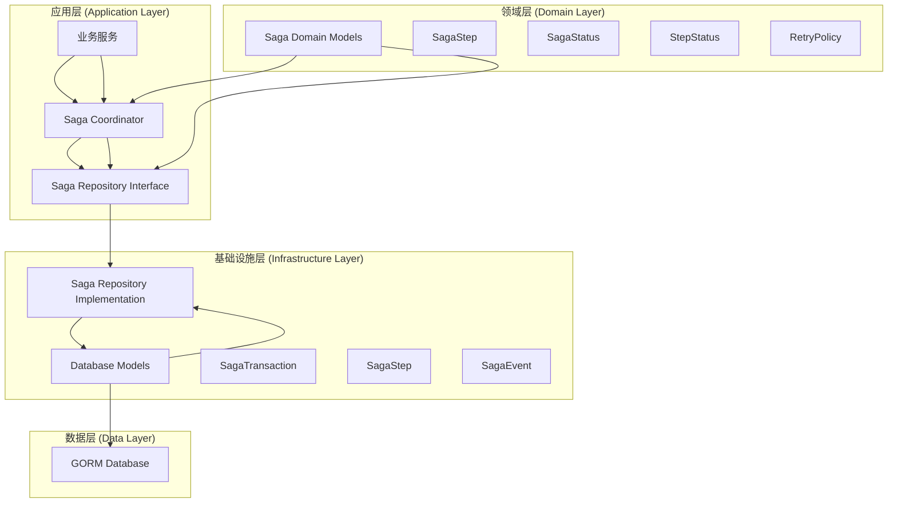
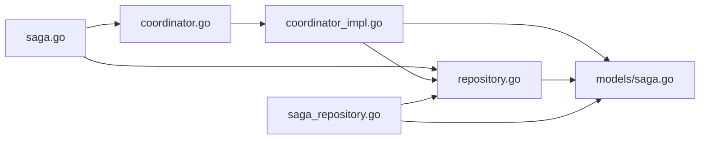

# Saga 模块架构说明

## 概述

Saga 模块是一个分布式事务协调器，用于管理跨服务的业务事务。它采用 Saga 模式来确保分布式事务的一致性和可靠性。

## 架构图



## 文件结构

```
internal/saga/
├── saga.go                 # 核心接口和数据结构定义
├── repository.go           # 数据访问接口定义
├── coordinator.go          # 协调器接口定义
├── coordinator_impl.go     # 协调器实现
├── example_usage.go        # 使用示例
└── README.md              # 本文档

internal/data/
├── models/
│   └── saga.go            # 数据库模型定义
└── saga_repository.go     # 数据访问实现
```

## 文件关系详细说明

### 1. **核心接口定义** (`internal/saga/saga.go`)
- **作用**: 定义 Saga 模式的核心接口和数据结构
- **包含内容**:
  - `SagaCoordinator` 接口：Saga 协调器的主要接口
  - `SagaStep` 结构体：定义单个 Saga 步骤
  - `SagaStatus` 结构体：Saga 事务状态
  - `StepStatus` 结构体：步骤状态
  - `RetryPolicy` 结构体：重试策略

### 2. **数据访问接口** (`internal/saga/repository.go`)
- **作用**: 定义数据访问层的抽象接口
- **包含内容**:
  - `Repository` 接口：定义了所有数据访问方法
  - 事务管理方法：创建、查询、更新事务
  - 步骤管理方法：创建、查询、更新步骤
  - 事件管理方法：记录和查询事件
  - 统计和监控方法

### 3. **协调器接口** (`internal/saga/coordinator.go`)
- **作用**: 定义 Saga 协调器的高级接口
- **包含内容**:
  - `Coordinator` 接口：提供事务管理、步骤管理、事件管理
  - 业务逻辑层面的方法定义
  - 支持事务查询、步骤重试、事件查询等

### 4. **协调器实现** (`internal/saga/coordinator_impl.go`)
- **作用**: 实现 Saga 协调器的具体逻辑
- **包含内容**:
  - `CoordinatorImpl` 结构体：实现 `Coordinator` 接口
  - 事务生命周期管理
  - 步骤执行和补偿逻辑
  - 错误处理和重试机制
  - 事件记录和状态更新

### 5. **数据模型** (`internal/data/models/saga.go`)
- **作用**: 定义数据库表结构对应的 Go 结构体
- **包含内容**:
  - `SagaTransaction`：Saga 事务表
  - `SagaStep`：Saga 步骤表
  - `SagaEvent`：Saga 事件表
  - 状态枚举和事件类型枚举

### 6. **数据访问实现** (`internal/data/saga_repository.go`)
- **作用**: 实现 Repository 接口，提供具体的数据访问逻辑
- **包含内容**:
  - `SagaRepository` 结构体：实现 `Repository` 接口
  - 使用 GORM 进行数据库操作
  - 事务、步骤、事件的 CRUD 操作
  - 查询和统计功能

## 依赖关系



### 依赖流向：
1. **`saga.go`** → 定义核心接口和数据结构
2. **`repository.go`** → 依赖 `saga.go` 中的接口定义
3. **`coordinator.go`** → 依赖 `saga.go` 中的数据结构
4. **`coordinator_impl.go`** → 依赖 `repository.go` 和 `models/saga.go`
5. **`saga_repository.go`** → 实现 `repository.go` 接口，依赖 `models/saga.go`

## 设计模式

这个架构采用了以下设计模式：

1. **依赖倒置原则**: 高层模块（Coordinator）依赖抽象接口（Repository），而不是具体实现
2. **接口隔离原则**: Repository 接口被细分为多个功能模块
3. **单一职责原则**: 每个文件都有明确的职责
4. **策略模式**: 通过接口实现不同的数据访问策略
5. **工厂模式**: 通过 NewCoordinator 和 NewSagaRepository 创建实例

## 核心概念

### Saga 事务状态
- `pending`: 待执行
- `in_progress`: 执行中
- `completed`: 已完成
- `failed`: 执行失败
- `compensating`: 补偿中
- `compensated`: 已补偿
- `cancelled`: 已取消

### 步骤状态
- `pending`: 待执行
- `in_progress`: 执行中
- `completed`: 已完成
- `failed`: 执行失败
- `compensating`: 补偿中
- `compensated`: 已补偿
- `skipped`: 已跳过

### 事件类型
- `saga_started`: Saga 开始
- `step_started`: 步骤开始
- `step_completed`: 步骤完成
- `step_failed`: 步骤失败
- `step_retried`: 步骤重试
- `step_skipped`: 步骤跳过
- `compensation_started`: 补偿开始
- `compensation_completed`: 补偿完成
- `saga_completed`: Saga 完成
- `saga_failed`: Saga 失败
- `saga_cancelled`: Saga 取消

## 使用示例

```go
// 1. 创建 Repository 实例
repo := data.NewSagaRepository(db)

// 2. 创建 Coordinator 实例
coordinator := saga.NewCoordinator(repo, logger, config)

// 3. 定义 Saga 步骤
steps := []saga.StepDefinition{
    {
        StepID:    "step1",
        StepName:  "创建订单",
        Action:    createOrderAction,
        Compensate: cancelOrderAction,
        MaxRetries: 3,
    },
    {
        StepID:    "step2", 
        StepName:  "扣减库存",
        Action:    reduceInventoryAction,
        Compensate: restoreInventoryAction,
        MaxRetries: 3,
    },
}

// 4. 启动 Saga 事务
transactionID, err := coordinator.StartTransaction(ctx, "创建订单事务", steps)
if err != nil {
    log.Error("启动事务失败", err)
    return
}

// 5. 查询事务状态
transaction, err := coordinator.GetTransaction(ctx, transactionID)
if err != nil {
    log.Error("查询事务失败", err)
    return
}
```

## 优势

1. **可测试性**: 通过接口抽象，便于单元测试和集成测试
2. **可扩展性**: 可以轻松添加新的数据访问实现或协调器实现
3. **可维护性**: 清晰的职责分离和模块化设计
4. **可靠性**: 完整的错误处理和补偿机制
5. **可观测性**: 详细的事件记录和状态跟踪

## 注意事项

1. 确保数据库表结构正确创建
2. 合理配置重试策略和超时时间
3. 实现适当的补偿逻辑
4. 监控事务执行状态和性能指标
5. 定期清理过期的数据和事件记录 